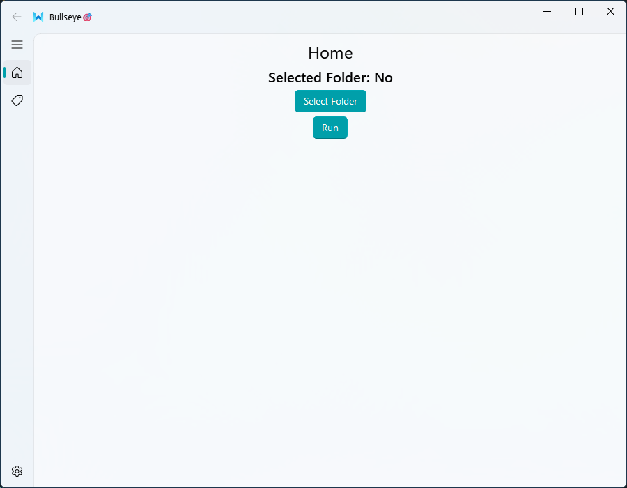

# Bullseye 🎯

<p align="center">
  
</p>
This is an AI-Powered Image Organizer  

Automatically categorizes images into folders using OpenAI's CLIP. Key features:  
- Zero-shot classification (no training data needed).  
- ONNX-optimized for 3x faster inference.  
- Handles custom labels (e.g., "Mistborn", "fantasy art").  

## How does it work? 🔨

It fetches OpenAI CLIP then it converts it to ONNX format, this increases the performance for the CPU. Then a json file is read with the labels
and the inference runs and based on the results, it creates a folder with the highest match and moves the file onto it.

## Dependencies 📃

- Pytorch
- OpenAI CLIP
- Pillow
- ONNX
- PySide6
- QFluentWidgets

## Example config:

You shouldn't duplicate labels with different spelling or both the plural and singular form of the word.

It's important to be consistent with the names, for example:

Valid configuration file✅
```json
{
    "labels": [
        "anime",
        "superheroes",
        "other"
    ]
}
```
Invalid configuration file❌
```json
{
    "labels": [
        "Anime",
        "animes",
        "superheroes",
        "Super Heroes",
        "Superheroes"
        "Other"
    ]
}
```

## Installation 🐍

Install dependencies

```sh
pip install -r pyproject.toml
```

## How to run 👍

```sh
python main.py
```

## License

This software is under GPL-3.0. See `LICENSE.md` for more information.